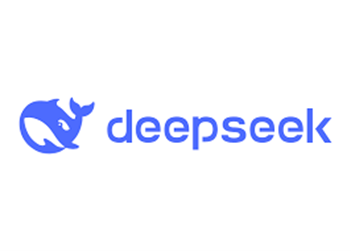

December 2025 marked a pivotal moment in artificial intelligence history, characterized by fierce competition between tech giants, breakthrough model releases, and significant regulatory developments. The month saw OpenAI and Google locked in an unprecedented AI race, the emergence of powerful open-source alternatives, and the U.S. government establishing a national AI policy framework.

# December 2025: Competition, Regulation, and Democratization Define AI's Future

## 1. OpenAI Releases GPT-5.2: A Response to Competitive Pressure [^1]

On December 11, 2025, OpenAI launched GPT-5.2, just one month after its previous update, in what many industry observers called a "code red" response to Google's Gemini 3. GPT-5.2 brings significant improvements in multi-step reasoning, long-context understanding (up to 256K tokens), coding capabilities, and professional knowledge work.

The model achieved state-of-the-art performance on GDPval benchmark, matching or exceeding human expert performance on 70.9% of professional tasks across 44 occupations. GPT-5.2 is designed for complex, real-world applications including spreadsheet modeling, presentation creation, and agentic workflows.

Alongside GPT-5.2, OpenAI introduced GPT-5.2-Codex, optimized specifically for software engineering with enhanced cybersecurity capabilities. The release signals OpenAI's determination to maintain its leadership position despite increasing competition from Google, Anthropic, and open-source alternatives, demonstrating how competitive pressure is accelerating the pace of AI innovation.

## 2. Google Deploys Gemini 3 Flash: Fast Intelligence for Everyone [^2]

Google responded to OpenAI's challenge by releasing Gemini 3 Flash on December 17, 2025, making it the default model in both the Gemini app and AI Mode in Google Search globally. Described as offering "frontier intelligence built for speed," Gemini 3 Flash combines the reasoning capabilities of Gemini 3 Pro with significantly faster processing at a fraction of the cost.

The model excels at multimodal understanding, coding, complex analysis, and visual Q&A. Notably, Gemini 3 Flash outperforms its predecessor by significant margins and even surpasses Gemini 3 Pro on certain benchmarks including MMMU-Pro (multimodal reasoning).

Google has been processing over 1 trillion tokens per day through its API since the Gemini 3 launch, highlighting massive adoption. The deployment across Google's ecosystem—including Search, Android Studio, and developer tools—gives Google unparalleled distribution advantages in the AI race, demonstrating how platform integration can accelerate AI adoption at unprecedented scale.

## 3. U.S. Government Establishes National AI Policy Framework [^3]

On December 11, 2025, President Trump issued an executive order titled "Ensuring a National Policy Framework for Artificial Intelligence," marking a dramatic shift toward federal control of AI regulation. The order establishes a "minimally burdensome" national AI policy and directs the Department of Justice to challenge state AI laws deemed inconsistent with federal priorities.

An AI Litigation Task Force was created within 30 days to identify and contest state regulations. The executive order specifically targets state laws that allegedly impose "ideological bias" requirements or create compliance burdens on interstate commerce. It also conditions federal broadband funding on states not enacting conflicting AI laws.

The move has sparked significant debate about federal versus state authority, with 42 state attorneys general previously urging stronger AI safeguards. This represents the most significant federal intervention in AI policy to date and will likely result in prolonged legal battles over jurisdiction and regulatory authority, fundamentally reshaping the governance landscape for AI development in the United States.

## 4. DeepSeek V3.2: Open-Source Model Challenges Closed Systems [^4]

Chinese AI company DeepSeek released DeepSeek-V3.2 and DeepSeek-V3.2-Speciale in early December 2025, demonstrating that open-source models can compete with proprietary systems at dramatically lower costs. The 671-billion-parameter Mixture-of-Experts model was trained for just $5.6 million on H800 GPUs, compared to hundreds of millions spent by competitors.

DeepSeek-V3.2-Speciale achieved gold-medal performance in the International Mathematical Olympiad (IMO) and International Olympiad in Informatics (IOI), rivaling GPT-5 and Gemini 3 Pro. The model introduces innovations including DeepSeek Sparse Attention (DSA) for efficient long-context processing, agentic reinforcement learning capabilities, and a thinking retention mechanism optimized for tool use.

At API costs of approximately $0.42 per million tokens, DeepSeek-V3.2 is roughly four times cheaper than GPT-5.2 while delivering comparable performance. The release validates the viability of open-source AI development and challenges the dominance of closed models, suggesting that the future of AI may be more distributed and accessible than previously assumed.

## 5. OpenAI Academy for News Organizations Launched [^5]

On December 14, 2025, OpenAI announced the "OpenAI Academy for News Organizations," a new initiative designed to help journalists and media outlets integrate AI into their workflows. The program offers financial grants, technical support, and access to OpenAI's latest models to help newsrooms automate administrative tasks and enhance investigative research.

The initiative aims to position AI as a tool for assisting journalism rather than replacing human reporters, addressing growing concerns about AI's role in media production and distribution. This represents OpenAI's attempt to build constructive partnerships with an industry that has been both a beneficiary and critic of AI technology.

This move comes amid broader industry concerns about AI's impact on journalism, including issues of content attribution, revenue sharing, and job displacement. The Academy represents a recognition that sustainable AI development requires addressing the concerns of industries affected by the technology, particularly those that provide training data and could be disrupted by AI capabilities.

## 6. AI Memory Chip Shortage Threatens Device Prices [^6]

December 2025 saw growing concerns about a global memory chip shortage driven by explosive AI data center demand. The construction of AI training facilities requires massive amounts of high-bandwidth memory (HBM) and RAM, creating supply constraints that are beginning to affect consumer electronics.

Micron Technology reported better-than-expected earnings while warning that industry supply will remain "substantially short of demand for the foreseeable future." As chipmakers prioritize lucrative AI-related orders, fewer memory chips are available for personal computers, smartphones, and consumer electronics.

Dell Technologies' COO Jeff Clarke noted that higher memory costs will likely be passed on to customers. Analysts predict that this shortage could lead to price increases across consumer devices in 2026, highlighting how AI development is creating ripple effects throughout the broader technology ecosystem and demonstrating the tangible economic impact of AI infrastructure demands on everyday consumers.

## Core Considerations for AI's Transformative Month

As AI development accelerates through intense competition and expanding capabilities, several critical themes emerge:

- **Competitive Acceleration**: The rapid-fire releases from OpenAI and Google demonstrate how competition is compressing development timelines, raising questions about the balance between innovation speed and safety considerations.
- **Distribution Advantages**: Google's ecosystem integration highlights how platform reach can amplify AI adoption, creating competitive moats beyond model performance alone.
- **Regulatory Centralization**: Federal intervention in AI policy signals a shift toward viewing AI as a matter of national competitiveness and security, with implications for innovation and governance.
- **Open-Source Viability**: DeepSeek's achievement demonstrates that resource-efficient approaches can challenge well-funded proprietary systems, potentially democratizing access to frontier AI capabilities.
- **Industry Partnership**: OpenAI's Academy initiative reflects growing recognition that sustainable AI development requires addressing concerns of affected industries and stakeholders.
- **Infrastructure Constraints**: Memory chip shortages illustrate how AI's resource demands create cascading effects throughout technology supply chains, with implications for consumer costs and availability.

## Conclusion

December 2025 will be remembered as a transformative month in AI history, defined by three key themes: intense competition, regulatory intervention, and the democratization of AI capabilities.

The fierce rivalry between OpenAI and Google reached new heights, with both companies releasing major updates within days of each other. This competition is driving unprecedented innovation but also raising questions about rushed releases and safety considerations. The emergence of powerful open-source alternatives like DeepSeek V3.2 challenges the assumption that only well-funded tech giants can develop frontier AI models.

The U.S. government's move to establish federal control over AI regulation signals a new era where AI policy becomes a matter of national competitiveness and security. The tension between state and federal authority will likely shape AI governance for years to come, creating uncertainty about regulatory frameworks while centralizing policy direction.

Finally, the memory chip shortage demonstrates how AI development creates cascading effects across the entire technology industry and economy. As AI systems grow more powerful and widespread, their resource demands will increasingly influence hardware availability and consumer prices, making AI's impact tangible for everyday users.

Looking ahead to 2026, the key questions are: Can the current pace of AI development be sustained safely? How will regulatory frameworks evolve globally? And will open-source models continue to narrow the gap with proprietary systems? The next chapter of the AI story promises to be even more consequential than the last.

## References

[^1]: [Introducing GPT-5.2](https://openai.com/index/introducing-gpt-5-2/)

[^2]: [Gemini 3 Flash Launch](https://blog.google/products/gemini/gemini-3-flash/)

[^3]: [National AI Policy Framework Executive Order](https://www.whitehouse.gov/presidential-actions/2025/12/eliminating-state-law-obstruction-of-national-artificial-intelligence-policy/)

[^4]: [DeepSeek V3.2 Research Paper](https://arxiv.org/abs/2412.19437)

[^5]: [OpenAI Academy for News Organizations](https://www.crescendo.ai/news/latest-ai-news-and-updates)

[^6]: [AI Memory Chip Shortage Impact](https://www.npr.org/2025/12/28/nx-s1-5656190/ai-chips-memory-prices-ram)
