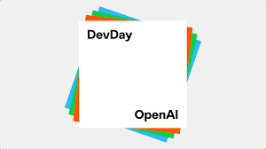
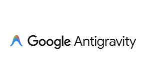
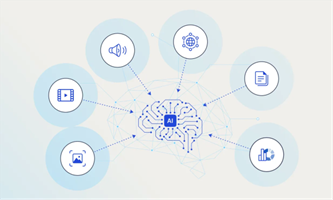

Artificial Intelligence continued its rapid transition from "chatbots" to full ecosystem-level infrastructure in November 2025. The month was defined by a decisive shift toward agentic AI platforms, where models are expected not only to generate answers but to plan, execute tasks, and integrate with software workflows, moving from experimental AI tools to scalable, real-world agent ecosystems.

# November 2025: The Agentic Era Becomes Mainstream Infrastructure

## 1. OpenAI DevDay 2025: ChatGPT Becomes an App Platform [^1]

OpenAI expanded ChatGPT beyond a chatbot by introducing Apps in ChatGPT along with the Apps SDK for developers. This allows interactive applications to run directly inside the chat interface, turning conversation into the main user interface. The announcement signals a shift toward ChatGPT functioning as a platform layer rather than a single product.

If adoption grows, "AI-first apps" could reduce reliance on traditional app navigation, fundamentally changing how users interact with software. Instead of navigating through menus, buttons, and screens, users would simply converse with AI to accomplish tasks across multiple applications.

This represents one of the strongest signs that the AI ecosystem is entering a platform era, where conversational interfaces become the primary method of accessing diverse functionality, similar to how mobile operating systems created platforms for app ecosystems.

## 2. Google Launches Gemini 3 + Releases Antigravity [^2]

Google released Gemini 3, positioning it as a major step forward in model intelligence and capability. Alongside it, Google launched Antigravity, described as an agent-first development experience. The key shift is moving AI from "assistive" responses to systems that support task planning and execution.

Antigravity represents Google's vision for how developers should build with agentic AI, providing tools and frameworks specifically designed for creating autonomous systems that can handle complex workflows. This contrasts with previous development approaches that treated AI as a question-answering service.

This strengthens Google's push into agent workflows for developers and enterprises, reflecting the industry trend toward agent ecosystems rather than standalone chat models. The combination of advanced model capabilities and developer infrastructure signals Google's commitment to enabling practical agent deployment.

## 3. EU Digital Omnibus: High-Risk AI Compliance Deadlines Pushed Toward Late 2027 [^3]

The EU proposed delaying enforcement of stricter rules for high-risk AI systems, linking implementation to standards readiness. Certain obligations may be pushed toward late 2027, reducing the pressure of a steep compliance deadline. This affects sectors such as education, hiring, finance, healthcare, and biometric systems where high-risk AI is common.

The decision signals that regulation is evolving in response to the speed of frontier AI development. Policymakers are recognizing that establishing meaningful compliance frameworks requires time to develop appropriate standards, testing methodologies, and governance structures that match the pace of technological advancement.

This also provides additional runway for companies to build audits, governance frameworks, and risk controls, acknowledging the practical challenges of implementing comprehensive AI safety measures while technology continues to evolve rapidly.

## 4. "Reasoning-First" Shift: From Fast Answers to Verification-Oriented AI [^4]

The AI industry shifted from prioritizing "fast answers" to emphasizing reasoning and reliability. Google pushed Gemini 3's deeper reasoning direction into product experiences, including Search-like use cases. At the same time, the wider ecosystem increasingly values systems that can handle multi-step tasks with fewer errors.

The focus is moving toward models that behave more like problem-solvers than text generators. This paradigm shift reflects growing recognition that speed without accuracy creates limited value, particularly for applications where errors have significant consequences or where complex tasks require multiple interconnected steps.

This trend matters because reasoning is foundational for agentic AI, where one wrong step can break the workflow. As AI systems take on more autonomous responsibilities, the ability to verify reasoning chains and ensure logical consistency becomes critical for maintaining reliability and user trust.

## 5. Mira Murati's Thinking Machines Faces Key Departures to OpenAI [^5]

A major industry reshuffle occurred when key people from Mira Murati's startup Thinking Machines Lab departed and rejoined OpenAI. This highlights how difficult it is for new frontier startups to compete against established labs with massive compute, infrastructure, and hiring advantages.

The event shows the "gravity effect" of major AI labs, where top talent tends to consolidate. Well-resourced organizations can offer not only competitive compensation but also access to unprecedented computational resources, large research teams, and the ability to work on cutting-edge problems at massive scale.

This became one of the most widely discussed talent-movement stories of the month, reflecting how important leadership stability and long-term research strategy are in frontier AI. The consolidation pattern raises questions about innovation diversity and whether smaller, independent research efforts can remain viable in an increasingly capital-intensive field.

## 6. Real-Time Multimodal AI Becomes Mainstream [^6]

Real-time multimodal interaction gained strong momentum as a new AI interface standard. OpenAI retired standard voice modes to unify users around Advanced Voice, making voice-first AI more integrated. Google also emphasized real-time multimodal capability through its Gemini ecosystem, enabling AI agents to react to screen and visual context.

This pushes AI beyond the "text box" toward low-latency assistants that can respond to real-world situations. The ability to seamlessly process voice, vision, and text in real-time creates fundamentally new interaction paradigms where AI can act as a responsive partner rather than a tool requiring explicit text commands.

Such systems are essential for agent-like workflows in productivity and daily tasks, enabling AI to understand context from multiple sources simultaneously and respond appropriately. The major challenge ahead remains privacy, safety, and trust in real-time agents that continuously perceive and process user environments.

## Core Considerations for the Agentic Transition

As AI evolves from assistive tools to autonomous agents, several critical themes define this transition:

- **Platform Architecture**: ChatGPT's transformation into an app platform demonstrates how conversational interfaces may become the primary method of accessing software functionality.
- **Agent-First Development**: Tools like Antigravity reflect the industry's recognition that building autonomous AI systems requires fundamentally different development approaches than traditional software.
- **Regulatory Adaptation**: The EU's timeline adjustment acknowledges that meaningful AI governance requires time to develop standards that match technological complexity.
- **Reasoning Over Speed**: The shift toward verification-oriented AI emphasizes reliability and multi-step problem-solving over rapid response generation.
- **Talent Concentration**: Movement of researchers toward well-resourced labs highlights the challenges smaller organizations face in frontier AI development.
- **Interface Evolution**: Real-time multimodal capabilities push AI interaction beyond text toward more natural, context-aware communication methods.

## Conclusion

November marked the point where the agentic era became mainstream infrastructure, not just experimentation. OpenAI positioned ChatGPT as a platform for interactive apps, while Google pushed agent-first development through Antigravity. At the same time, the EU's decision to delay high-risk AI obligations acknowledges that regulation is struggling to keep pace with frontier AI capabilities.

The month's developments demonstrate that AI is transitioning from being a tool that answers questions to becoming infrastructure that executes complex workflows autonomously. This shift requires new development frameworks, different regulatory approaches, and fundamentally reimagined user interfaces that move beyond traditional software interaction patterns.

The key takeaway is that future advantage lies less in prompting and more in designing workflows where AI operates as a controlled, semi-autonomous agent under human supervision. As this transition accelerates, the challenge will be building systems that are simultaneously powerful enough to handle complex tasks and controllable enough to maintain human oversight and alignment with user intentions.

## References

[^1]: [Introducing Apps in ChatGPT](https://openai.com/index/introducing-apps-in-chatgpt)

[^2]: [Gemini 3 Launch](https://blog.google/products-and-platforms/products/gemini/gemini-3)

[^3]: [EU Digital Omnibus](https://www.pwc.com/us/en/services/consulting/cybersecurity-risk-regulatory/library/tech-regulatory-policy-developments/eu-digital-omnibus.html)

[^4]: [Gemini 3 Reasoning Capabilities](https://blog.google/products-and-platforms/products/gemini/gemini-3/)

[^5]: [Thinking Machines Lab Departures](https://www.wired.com/story/thinking-machines-lab-cofounders-leave-for-openai)

[^6]: [Gemini Multimodal Capabilities](https://deepmind.google/models/gemini)
