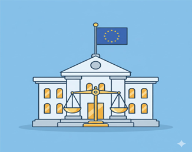

October 2025 continued the momentum of major developments in artificial intelligence, especially in the areas of on-device AI, global regulation, large-scale economic impact, and agent-based AI systems, marking a clear shift toward practical, real-world integration of AI into devices, workplaces, services, and regulation frameworks.

# October 2025: AI Shifts from Breakthrough to Integration

## 1. On-Device AI Rolls Out to More Consumer Devices [^1]

This month saw a broader rollout of Apple's "Apple Intelligence" system to more iPhones, iPads, and Macs. The update focuses on privacy-preserving on-device AI, allowing users to summarize content, generate writing suggestions, and organize information—without sending data to cloud servers. This shift signals a growing trend: AI processing is moving directly into personal devices, reducing dependence on remote compute centers.

The significance of this rollout lies in its approach to user privacy and data sovereignty. By processing AI workloads locally rather than in cloud infrastructure, Apple is addressing growing concerns about data privacy while demonstrating that sophisticated AI capabilities can operate within the constraints of consumer devices.

This development represents a fundamental architectural shift in how AI services are delivered, moving away from centralized cloud-based processing toward distributed, device-level computation that gives users greater control over their personal data.

## 2. First Compliance Phase of the EU AI Act Begins [^2]

The EU AI Act, the world's most comprehensive AI regulation framework, entered its first enforcement phase in October. Companies operating in the EU must now disclose certain high-risk AI system usage and adhere to transparency requirements. This marks a major milestone in global AI governance, influencing regulatory discussions in Asia, Africa, and North America.

The implementation of the EU AI Act represents the first major regulatory framework specifically designed to govern AI systems, establishing precedents that are likely to shape AI governance globally. The Act's risk-based approach categorizes AI systems according to their potential impact, with stricter requirements for high-risk applications.

This regulatory milestone signals the maturation of AI governance, moving from voluntary guidelines and self-regulation toward enforceable legal frameworks that balance innovation with accountability and public protection.

## 3. Meta Advances Work on AI "Agents" [^3]

Meta continued its investment in agentic AI systems by publishing new research on autonomous reasoning agents capable of multi-step planning. These agents are designed to complete complex tasks—such as scheduling, data processing, and workflow coordination—with minimal user input. Meta emphasizes that agents are not meant to replace users, but to collaborate with them.

The development of autonomous agents represents a significant evolution in AI capabilities, moving beyond single-turn interactions toward systems that can pursue goals over extended timeframes while adapting to changing circumstances and user needs.

This research highlights the industry's focus on developing AI systems that can handle complex, multi-faceted tasks independently while maintaining alignment with user intentions, suggesting a future where AI acts as a collaborative partner rather than simply a tool.

## 4. OpenAI Introduces Improved Agent Control & Safety Tools [^4]

OpenAI released updates to its agent control APIs, giving developers stronger oversight tools such as action approval logs, usage boundaries, and more explicit fail-safe triggers. This continues the industry trend of balancing powerful autonomous AI with practical safety constraints, ensuring AI stays aligned with user intent.

The introduction of enhanced control mechanisms reflects the growing recognition that as AI systems become more autonomous and capable, developers need robust tools to maintain oversight and ensure systems behave as intended. These safety features enable developers to define clear boundaries for AI behavior while maintaining transparency about system actions.

This development represents a practical approach to AI safety, providing developers with concrete tools to implement safety measures rather than relying solely on theoretical frameworks or post-hoc interventions.

## 5. Google Showcases Gemini on Pixel Devices [^5]

During the annual Pixel launch event, Google highlighted improvements to Gemini Nano, the lightweight on-device version of its Gemini model. The update allows real-time summarization, enhanced voice interaction, and offline translation directly on phones without cloud processing. This reinforces the shift toward personalized, device-level AI capabilities.

Google's focus on Gemini Nano demonstrates the technical feasibility of running sophisticated language models entirely on mobile devices, eliminating latency, reducing bandwidth requirements, and enhancing privacy. The offline capabilities are particularly significant for users in areas with limited connectivity.

This advancement shows that on-device AI is not merely a privacy feature but enables entirely new use cases where cloud connectivity is unavailable, unreliable, or undesirable, expanding AI accessibility globally.

## 6. IMF Highlights AI's Growing Impact on Global Jobs [^6]

The International Monetary Fund (IMF) released a report this month analyzing how AI adoption will reshape labor markets worldwide. The report suggests AI could increase global productivity significantly, but also emphasizes the need for worker retraining and digital education programs to prevent widening inequality. Governments are urged to prepare now.

The IMF's analysis underscores that AI's economic impact extends far beyond productivity gains, raising fundamental questions about workforce adaptation, income distribution, and social safety nets. The report highlights the urgent need for proactive policy responses to ensure AI's benefits are broadly shared.

This economic assessment from a major international institution signals that AI's societal impact is now recognized at the highest levels of global economic governance, requiring coordinated responses from governments, educational institutions, and private sector stakeholders.

## Core Considerations for AI's Practical Integration

As AI transitions from breakthrough announcements to widespread deployment, several critical themes emerge:

- **Device-Level Processing**: The shift toward on-device AI reflects growing privacy concerns and technical maturation, enabling AI capabilities without cloud dependence.
- **Regulatory Implementation**: The EU AI Act's enforcement phase establishes concrete governance frameworks that will influence global AI development and deployment practices.
- **Autonomous Agents**: Progress in agentic AI systems demonstrates the evolution toward AI that can handle complex, multi-step tasks with minimal human intervention.
- **Safety Infrastructure**: Enhanced developer tools for agent control reflect the industry's focus on building practical safety mechanisms into AI systems from the ground up.
- **Accessibility Expansion**: On-device capabilities like offline translation and summarization extend AI benefits to users regardless of connectivity or infrastructure.
- **Economic Transformation**: Recognition from institutions like the IMF highlights AI's profound impact on labor markets and the urgent need for workforce adaptation strategies.

## Conclusion

October 2025 showcased a clear shift toward practical, real-world integration of AI—into devices, workplaces, services, and regulation frameworks. The narrative of AI is no longer only about model breakthroughs; it is increasingly about governance, access, user control, and economic adaptation.

The month's developments demonstrate that AI technology is maturing beyond pure capability improvements toward addressing fundamental challenges of deployment, safety, privacy, and societal impact. From on-device processing to regulatory enforcement, the focus has shifted to making AI work reliably and responsibly in real-world contexts.

As the AI landscape matures, the next stage will be defined by how effectively individuals, companies, and governments learn to collaborate with intelligent systems—safely and responsibly. The challenge is no longer just building more capable AI, but ensuring these capabilities serve humanity equitably and sustainably.

## References

[^1]: [Introducing Apple Intelligence](https://www.apple.com/newsroom/2024/06/introducing-apple-intelligence/)

[^2]: [EU AI Act Enforcement Phase](https://ec.europa.eu/commission/presscorner/detail/en/ip_24_1234)

[^3]: [Meta AI Blog](https://ai.meta.com/blog/)

[^4]: [OpenAI Blog](https://openai.com/blog)

[^5]: [Google Products Blog](https://blog.google/products/)

[^6]: [International Monetary Fund](https://www.imf.org/)
